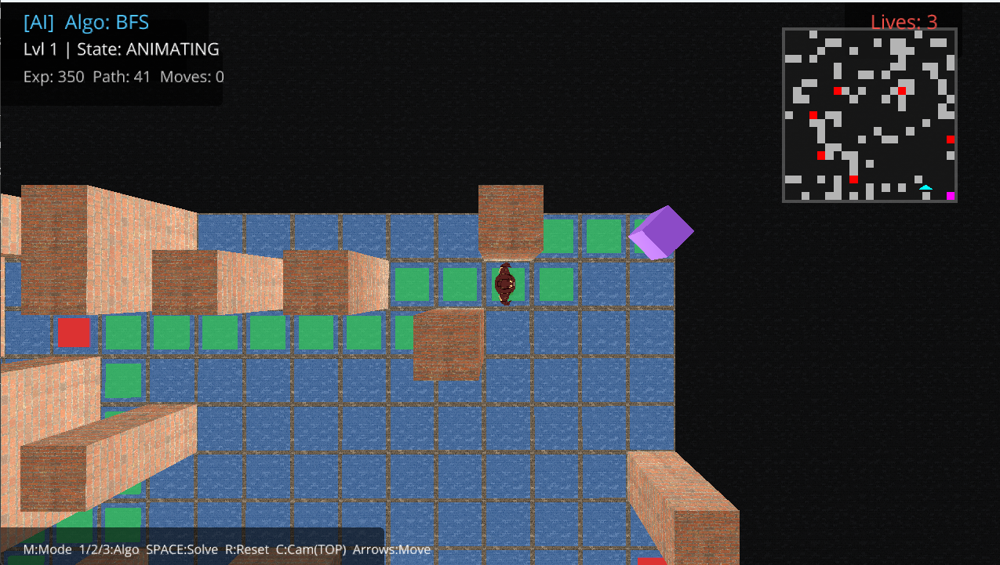
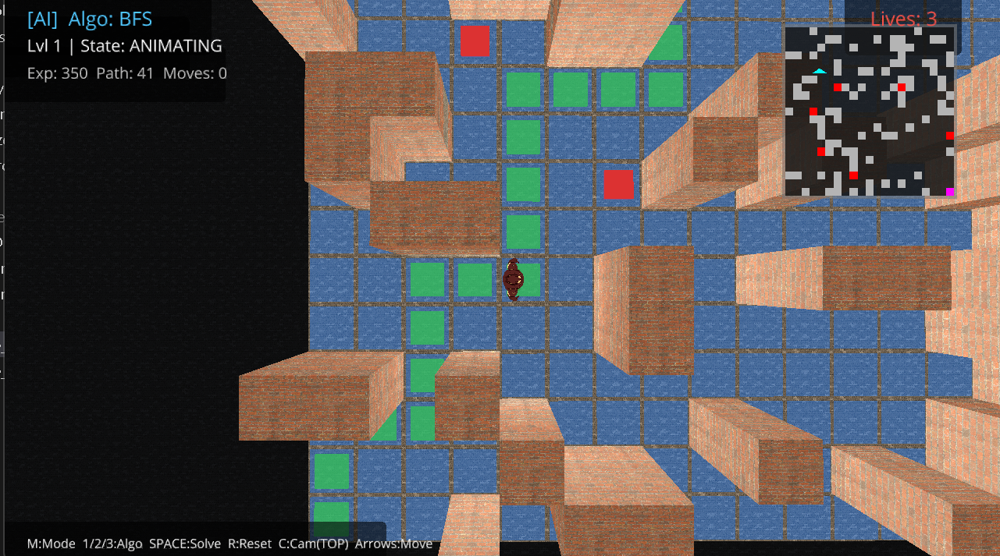
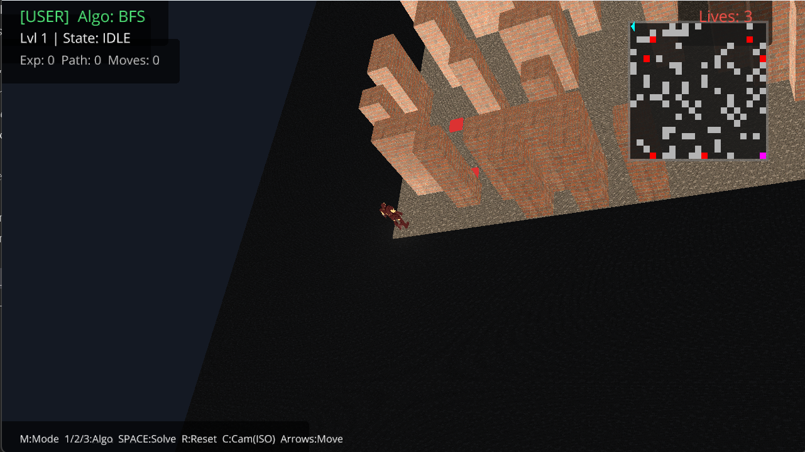
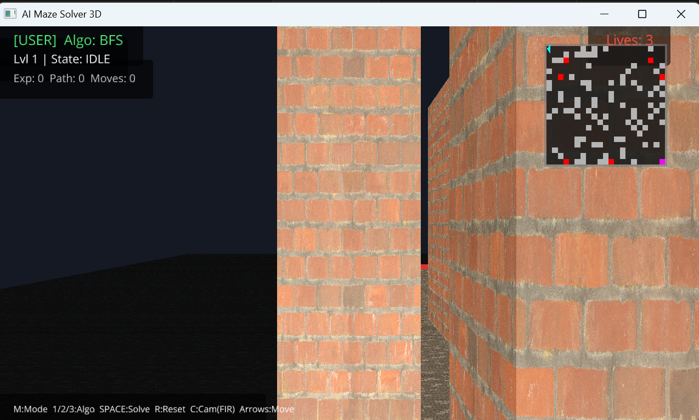

<div align="center">

<!-- Header Banner -->


<br/>

<!-- Badges -->
<p>
  
  
  
  
</p>

<p>
  
  
  
</p>

<br/>

*An interactive, dual-engine Python game where you can manually navigate a procedurally generated maze — or sit back and watch an AI solve it in real time.*

<br/>

</div>

---

## 📸 Screenshots

<p align="center">
  
  
  <br><br>
  
  
</p>

---

## 🗂️ Project Overview

**AI Maze Solver 3D** ships two fully playable versions built on a shared core engine:

| Version | Engine | Highlights |
|---|---|---|
| **3D** — `maze_3d.py` | `ursina` | Dynamic lighting, Iron Man 3D model, minimap, 3 camera views |
| **2D** — `maze_ai_game.py` | `pygame` | Classic top-down view, burst trap animations, lightweight |

Both versions support manual play and AI-driven solving across three algorithms.

---

## ✨ Features

### 🎮 Two Play Modes
- **USER Mode** — Navigate the maze yourself using arrow keys
- **AI Mode** — Set the agent loose and watch it pathfind autonomously

### 🧠 Three AI Algorithms
```
BFS  ──  Breadth-First Search   →  Guarantees shortest path
DFS  ──  Depth-First Search     →  Fast, memory-efficient exploration  
A★   ──  A-Star Search          →  Heuristic-guided optimal pathing
```

### 🏗️ Procedural Maze Generation
Every reset or level advance spawns a brand-new maze via a custom `Maze` class — walls, traps, and all.

### 💥 Traps & Lives System
- Hidden and visible traps are scattered across the grid
- Stepping on a trap: **−1 life** + screen flash + sound effect
- 3 lives total — reach 0 and it's **game over**

### 📈 Level Progression *(3D Version)*
Reaching the goal (purple beacon) triggers a win screen and auto-advances to the next level with an **expanded grid** — the maze grows harder.

### 📊 Live Statistics HUD
Both versions display real-time overlays tracking:

> Nodes Explored · Path Length · Move Count · Current Level · Algorithm · Lives Remaining

---

## 🕹️ Controls

### Global
| Key | Action |
|-----|--------|
| `M` | Toggle between **USER** and **AI** mode |
| `R` | Reset the current maze |

### AI Mode
| Key | Action |
|-----|--------|
| `1` | Select **BFS** |
| `2` | Select **DFS** |
| `3` | Select **A★** |
| `Space` | Start the AI Solver (visualizes exploration, then animates the path) |

### User Mode
| Key | Action |
|-----|--------|
| `↑ ↓ ← →` | Move the character *(adapts to camera in 3D)* |

### 3D Exclusive (`maze_3d.py`)
| Key | Action |
|-----|--------|
| `C` | Cycle camera: **First-Person → Top-Down → Isometric** |

---

## 🛠️ Tech Stack

```
AI Maze Solver 3D
├── Python 3.x
├── Ursina Engine     →  3D rendering, models, shaders, dynamic lighting
└── Pygame            →  2D rendering, fonts, animation
```

### 📁 Project Structure

```
AI-Maze-Solver-3D/
│
├── maze_3d.py              # 3D game entry point (Ursina)
├── maze_ai_game.py         # 2D game entry point (Pygame)
│
├── core/
│   ├── maze.py             # Procedural maze generation
│   ├── search.py           # BFS, DFS, A* algorithms
│   └── agent.py            # Agent state tracking
│
└── assets/
    ├── Octane.obj          # Iron Man 3D model (player)
    └── ...                 # Textures, sounds
```

---

## 🚀 Installation & Setup

### 1 · Clone the Repository
```bash
git clone https://github.com/deykris777/AI-Maze-Solver-3D.git
cd AI-Maze-Solver-3D
```

### 2 · Install Dependencies
```bash
pip install ursina pygame
```
> Or if a requirements file is present:
> ```bash
> pip install -r requirements.txt
> ```

### 3 · Run
```bash
# 3D Version (Ursina)
python maze_3d.py

# 2D Version (Pygame)
python maze_ai_game.py
```

---

## 🧩 How It Works

```
   START
     │
     ▼
Maze Generated (random walls + traps)
     │
     ├─── USER MODE ──► Arrow keys move agent → avoid traps → reach goal
     │
     └─── AI MODE ────► Select algorithm → press Space
                              │
                    ┌─────────┴──────────┐
                    │                    │
                  BFS/DFS              A★ Search
              (explore grid)    (heuristic pathfinding)
                    │                    │
                    └─────────┬──────────┘
                              │
                     Visualize exploration
                              │
                     Animate path to goal
                              │
                       Win → Next Level
                       (larger maze!)
```

---

## 👥 Team

<div align="center">

### 🛠️ Author & Lead Developer

<table>
  <tr>
    <td align="center">
      <a href="https://github.com/deykris777">
        <br/>
        <sub><b>deykris777</b></sub>
      </a><br/>
      <sub>Author · Lead Developer</sub>
    </td>
  </tr>
</table>

### 🤝 Contributors

<table>
  <tr>
    <td align="center">
      <a href="https://github.com/Girvan08">
        <br/>
        <sub><b>Girvan08</b></sub>
      </a><br/>
      <sub>Contributor</sub>
    </td>
    <td align="center">
      <a href="https://github.com/prabuddha7">
        <br/>
        <sub><b>prabuddha7</b></sub>
      </a><br/>
      <sub>Contributor</sub>
    </td>
  </tr>
</table>

<br/>

*Built with ❤️ and a lot of pathfinding*


</div>
